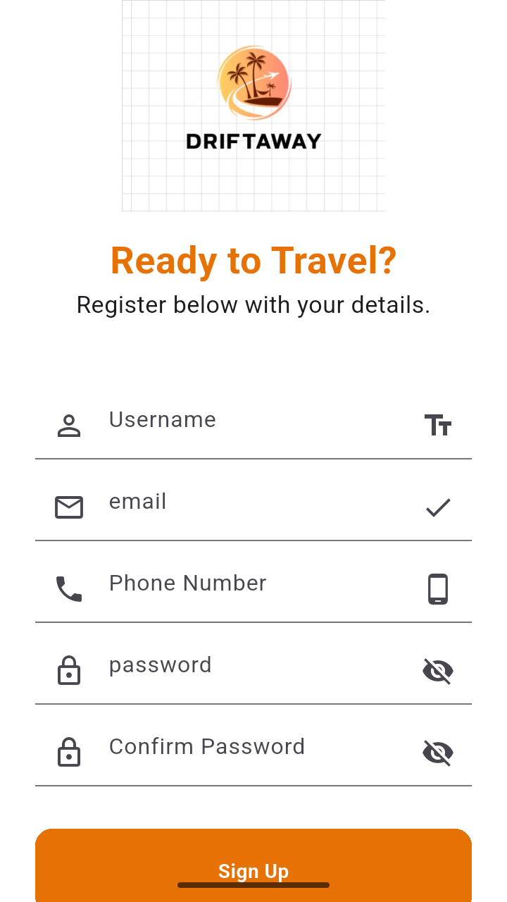
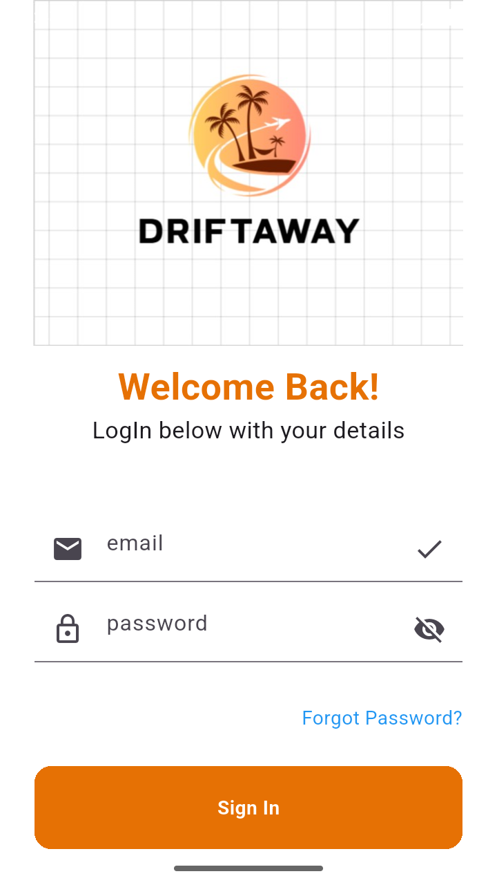
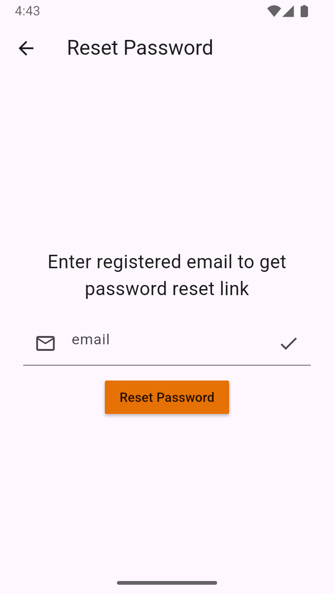
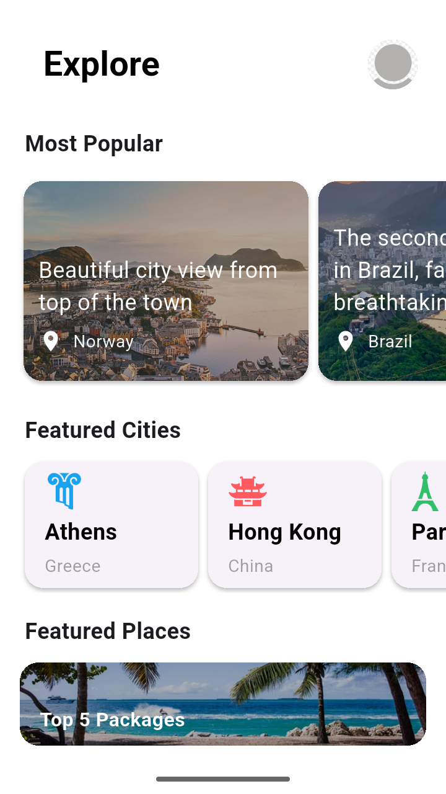
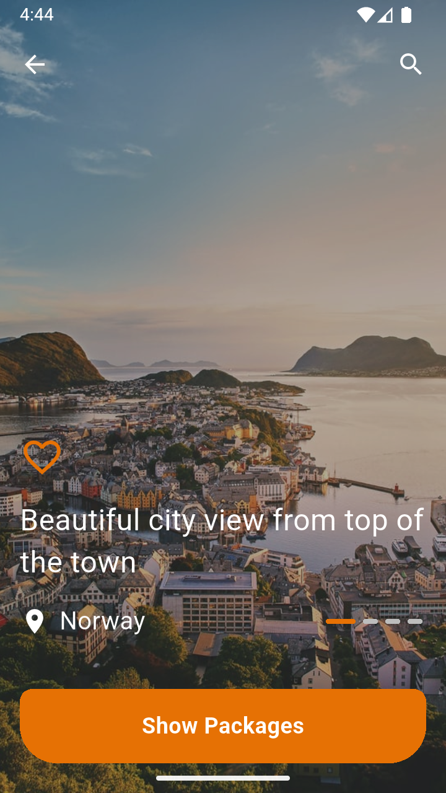
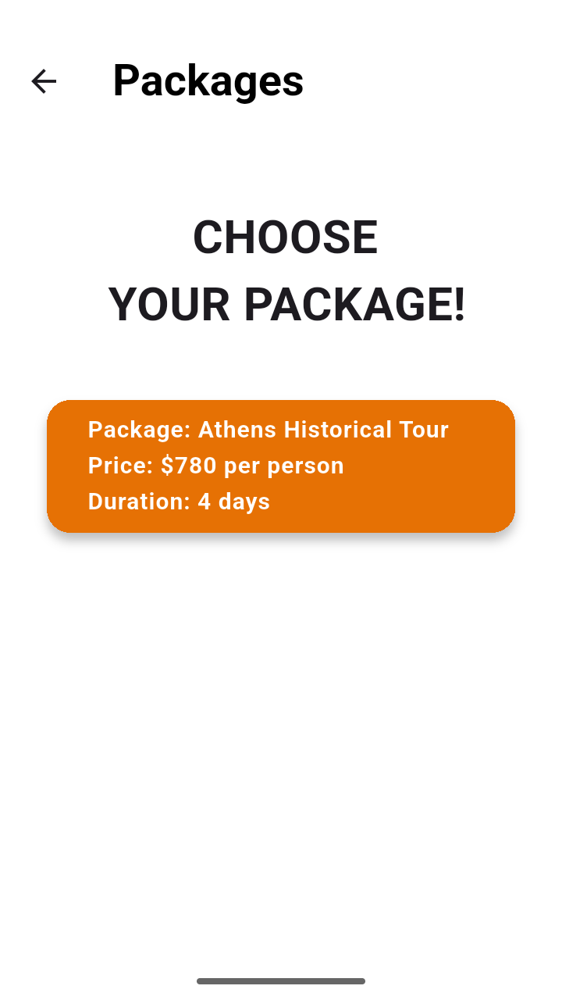
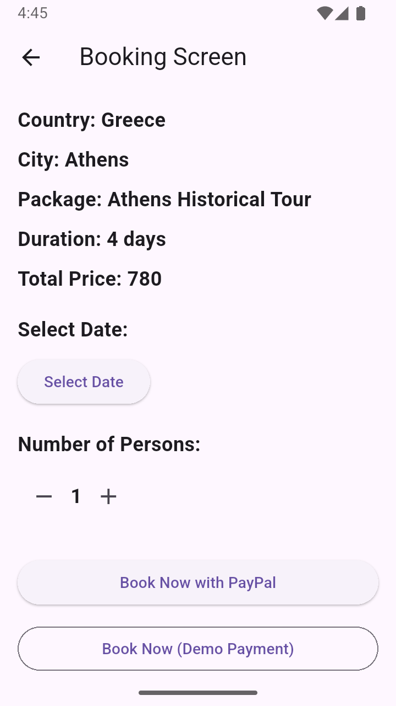
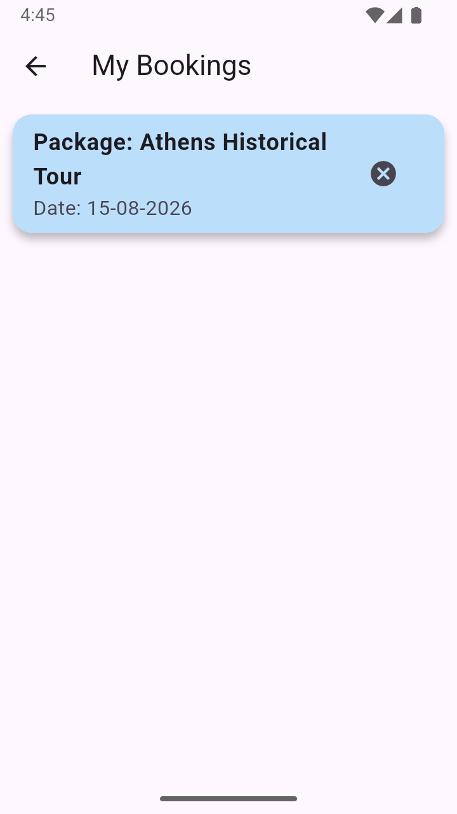
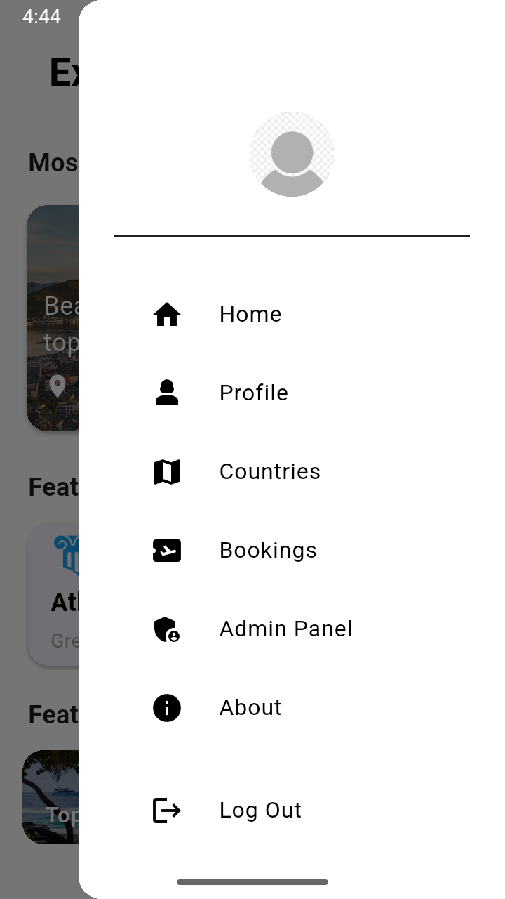
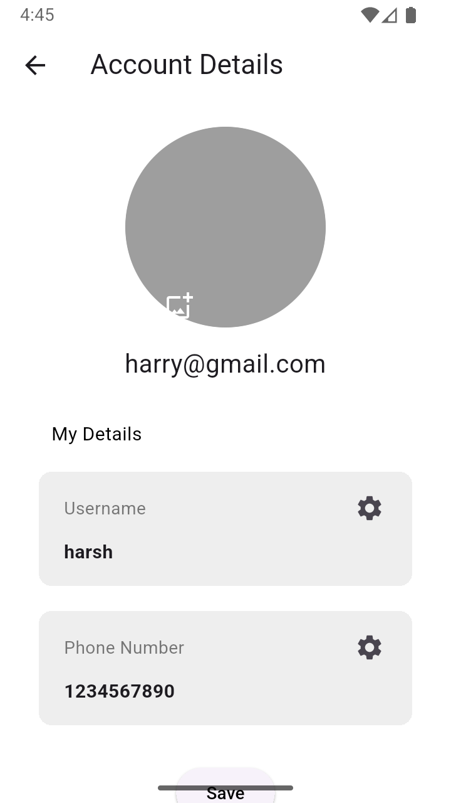

# DriftAway ✈️

DriftAway is a Flutter travel-booking app that lets users browse destinations, explore travel packages by country, book a package with a date and number of travelers, pay via PayPal, and view their booking history.

## Features

- **Explore screen** — browse popular places, featured cities/destinations, and featured lists.
- **Country list** — browse countries to see available travel packages.
- **Package screen** — view packages for a selected country, pulled live from Firestore.
- **Booking screen** — pick a date and number of travelers, see the live total price, and pay via PayPal (sandbox mode).
- **Booking confirmation** — animated confirmation screen that auto-redirects to "My Bookings."
- **My Bookings** — view a user's past bookings.
- **Profile** — view/edit username and phone number, upload a profile picture.
- **Top features screen** — shows top booked packages, cities, and destinations.
- **App drawer** — navigation to Home, Profile, Countries, Bookings, Admin Panel, and About.

## Tech Stack

- **Framework:** Flutter (Dart)
- **Backend:** Firebase (Cloud Firestore, Authentication, Storage)
- **Payments:** [`flutter_paypal_payment`](https://pub.dev/packages/flutter_paypal_payment)
- **Other packages:** `intl`, `image_picker`

## 📸 Screenshots

Register Screen              |   Login Screen          |   Forgot Password     |   Explore Screen
:-------------------------:|:-------------------------:|:-------------------------:|:-------------------------:
|||

Places Screen            |   Package Screen          |   Booking Screen     |   My Bookings Screen
:-------------------------:|:-------------------------:|:-------------------------:|:-------------------------:
|||

App Drawer              |   Profile Screen             |   Top Booked Packages               
:-------------------------:|:-------------------------:|:-------------------------:
||
---

## Setup

```bash
git clone https://github.com/<your-username>/driftaway.git
cd driftaway
flutter pub get
flutter run
```

Requires a Firebase project (Firestore, Authentication, and Storage enabled) connected via `flutterfire configure` or manually added config files.

## Author

Developed with Flutter by **Harsh Peke**
